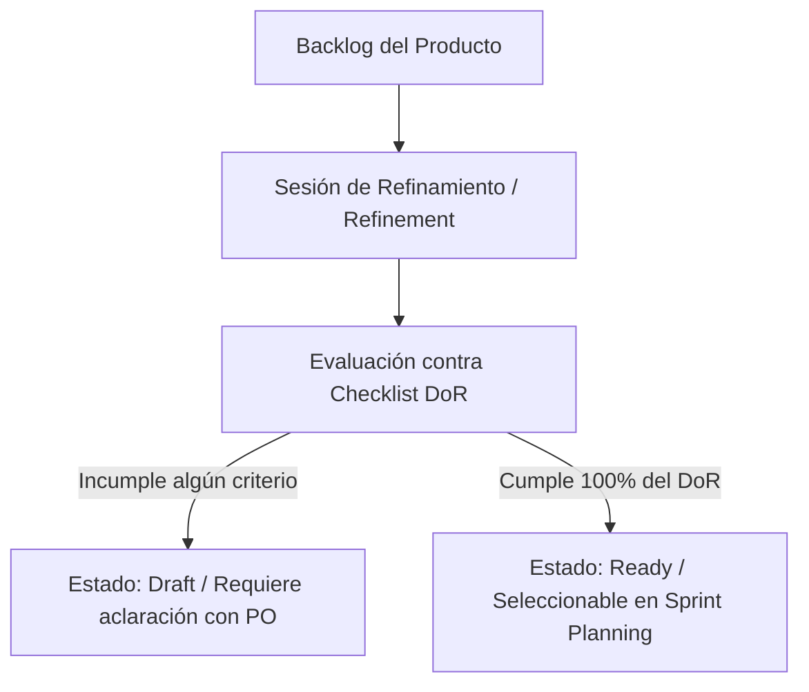

# Definition of Ready (DoR) — Web Solutions SL

## 1. Propósito
El **Definition of Ready (DoR)** establece el conjunto de condiciones mínimas de calidad y claridad que debe cumplir una Historia de Usuario (`US-XXX`) para ser aceptada en la planificación de un Sprint (*Sprint Planning*) y pasar al estado **"Ready for Development"**. 

Su objetivo es evitar bloqueos durante el desarrollo, asegurar el entendimiento común entre el Product Owner y el equipo técnico, y garantizar que las tareas cumplan con los acuerdos del *Team Charter*.

---

## 2. Lista de Comprobación (Checklist de DoR)

Una Historia de Usuario solo se considerará **Ready** si satisface todos los siguientes puntos:

### A. Trazabilidad y Estructura Base
- [ ] **Identificador Único:** Cuenta con un ID estandarizado (`US-XXX`) asignado dentro de su Épica correspondiente (`EP-XXX`).
- [ ] **Formato Estándar:** Está redactada siguiendo la estructura estándar:  
  > *Como* [rol / tipo de usuario]  
  > *Quiero* [acción / funcionalidad]  
  > *Para* [beneficio / valor de negocio esperado]
- [ ] **Necesidad y Objetivo:** Define explícitamente la necesidad que resuelve y el objetivo específico que persigue dentro del sistema.

### B. Criterios de Aceptación y Alcance
- [ ] **Criterios de Aceptación Verificables:** Contiene al menos 2 criterios de aceptación numerados (`US-XXX-AC-YY`) que definen el comportamiento esperado sin ambigüedades.
- [ ] **Casos Límite y Reglas de Negocio:** Especifica las reglas de negocio aplicables y al menos un caso límite (*edge case*) o de error contemplado.
- [ ] **Sin Ambigüedades:** La historia está completamente descrita y no requiere aclaraciones adicionales por parte del Product Owner para comenzar su desarrollo.

### C. Estimación y Planificación
- [ ] **Prioridad MoSCoW:** Tiene asignada una prioridad (*Must, Should, Could*) acompañada de su correspondiente justificación de negocio.
- [ ] **Estimación en Horas-Persona:** Dispone de una estimación de esfuerzo en horas-persona ($h-p$) acordada en la sesión de refinamiento.
- [ ] **Nivel de Incertidumbre:** Se ha categorizado el nivel de incertidumbre técnica (*Baja, Media, Alta*).
- [ ] **Gestión de Predecesores:** Se han identificado los requisitos predecesores obligatorios y estos se encuentran completados o planificados en la misma iteración.
- [ ] **Iteración Asignada:** Se ha definido la iteración objetivo (`IT-001`, `IT-002`, `IT-003`).

### D. Requisitos No Funcionales y Restricciones
- [ ] **Restricciones Técnicas y RNF:** Se especifican las restricciones de seguridad, rendimiento, diseño *responsive* o volumen de datos aplicables a la tarea.
- [ ] **Supuestos e Hipótesis:** Se listan las asunciones técnicas o de infraestructura previas necesarias para su ejecución.

### E. Acuerdos de Calidad y Capacidad del Equipo (Team Charter)
- [ ] **Límite de WIP (Work in Progress):** La asignación de esta historia no provoca que ningún miembro del equipo supere el límite de **2 tareas simultáneas en progreso**.
- [ ] **Validación del PO:** La historia ha sido revisada y aprobada explícitamente por el Product Owner (Javier García).

---

## 3. Flujo de Aplicación del DoR

